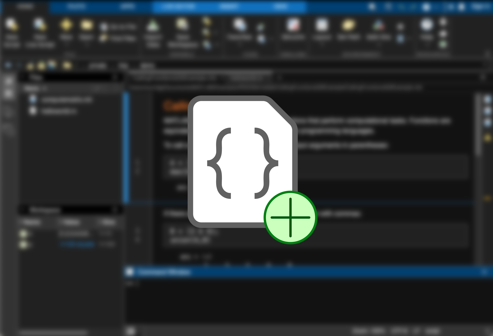
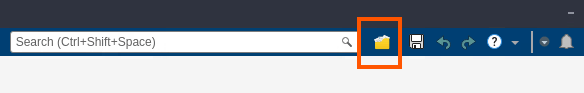
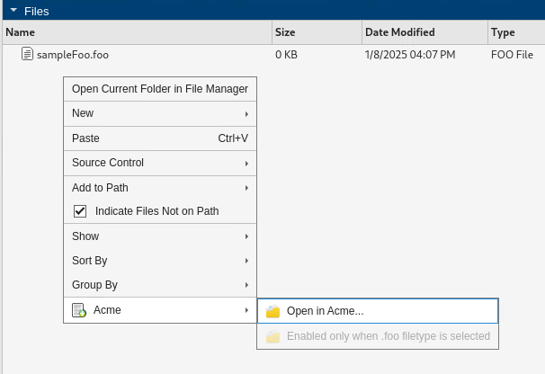
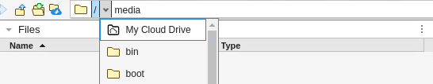
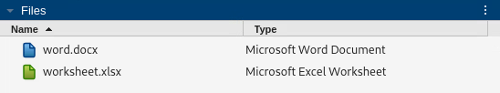
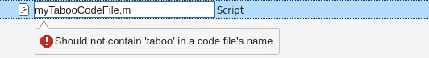

# Extension Points Examples (Beta)

 

You can extend various functionalities of the MATLAB&reg; desktop using Extension Points. For example, you can add custom items to the Quick Access Toolbar or change the icon or label for a file type in the Files panel.

Includes examples for the following Extension Points. These customizations are enabled as soon as you install the toolbox.

 

#### Add an item to the Quick Access Toolbar
`mw.desktop.quickAccess` - Add a new button to the Quick Access Toolbar that triggers a MATLAB callback function.

*Note: This Extension Point is compatible from R2025a onwards.*

 

#### Add an item to the Files and Projects Panel Context Menus
`mw.desktop.fileBrowsers.contextMenu` - Add new menu items / submenus to the Files Panel and Projects Panel context menus, that show up conditionally (e.g. for specific filetype selections) and triggers a MATLAB callback function when clicked.

*Note: This Extension Point is compatible from R2025a onwards.*

 

#### Add New Displayed Roots to the Address Bar
`mw.desktop.addressBar.displayedRoots` - Customize the list of displayed roots in the Address Bar.

 

#### Customize File Type Icons and Labels
`mw.fileTypes.icons` — Specify the icon that displays for a file type in the Files panel, including the File Preview.

`mw.fileTypes.labels` — Specify the label that displays for a file type in the Files panel, including the Type column and File Preview.

 

#### Custom File Name Validation
`mw.fileTypes.fileNameValidation` — Add filename validation for a file type to ensure the filename is valid when a file of that type / group is created or renamed.

 

### MathWorks Products (https://www.mathworks.com)

Requires MATLAB release R2024b or newer
- [New Desktop for MATLAB Beta](https://www.mathworks.com/matlabcentral/fileexchange/119593-new-desktop-for-matlab-beta)

 

## Getting Started
[Extend MATLAB Using Extension Points](https://www.mathworks.com/help/matlab/extend-the-desktop.html)

You can choose to modify the existing example `extensions.json` within this toolbox or create your own toolbox using the following instructions.

1. Create a JSON-formatted file named `extensions.json` and place it in a folder named `resources` within your toolbox.
2. Add a set of JSON declarations to `extensions.json` that defines your customizations using the Extension Points.
3. Add the folder containing the `resources` folder to the MATLAB path. To add the folder to the path, use the `addpath` function or right-click the folder in the Files panel and select `Add to Path` > `Selected Folders and Subfolders`.

 

## License
The license is available in the License.txt file in this GitHub repository.

 

## Community Support
[MATLAB Central](https://www.mathworks.com/matlabcentral)

 

Copyright 2024-2025 The MathWorks, Inc.
